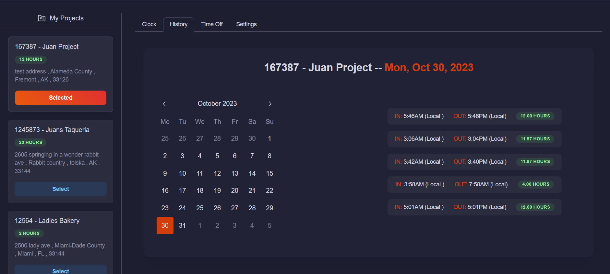

# HackWorkz Time Management

A time managemement solution for Procore instances.

## Features

- Responsive
- Auto sync projects to Procore based on the current user.
- Ability to limit weekly time ranges for user when clocking in.
- Ability to view clock in history for any day
- Times shown locally
 

## Screenshots

